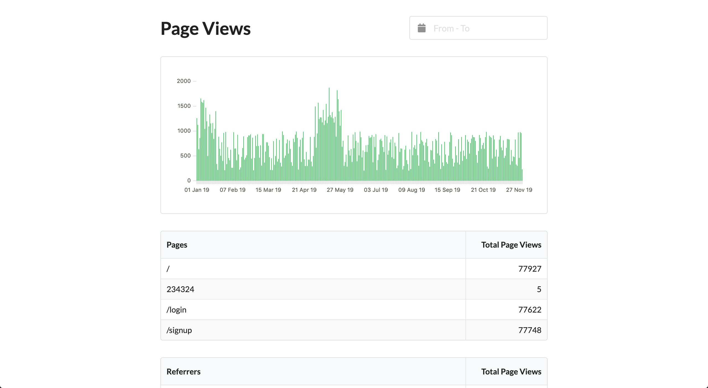

# Raylight

Open source privacy-friendly analytics

## Screenshots

Home


Login


## Local development

Install `docker` and `docker-compose`

Start the containers

```shell
$ docker-compose up --build
```

Migrate and seed the database

```shell
$ docker-compose run raylight npm run migrate
$ docker-compose run raylight npm run seed
```

Optional: seed the data with test values

```shell
$ docker-compose run raylight npm run seed:test
```

## Production

```shell
$ docker-compose -f docker-compose.yml up
$ docker-compose run raylight npm run migrate
$ docker-compose run raylight npm run seed
```
